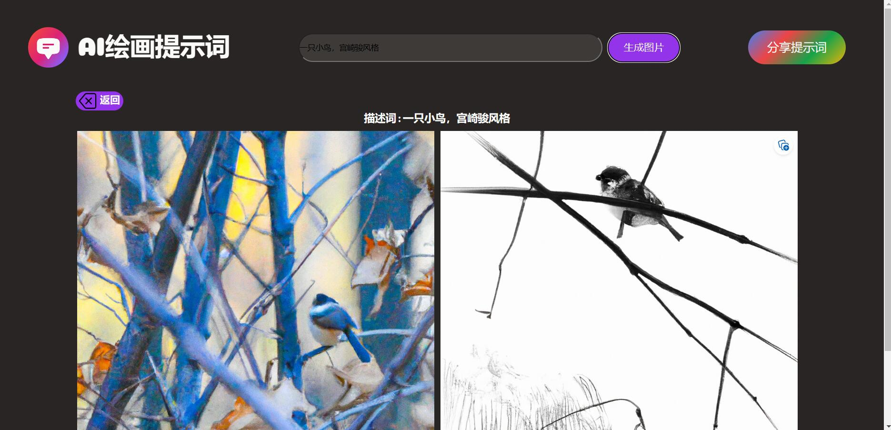
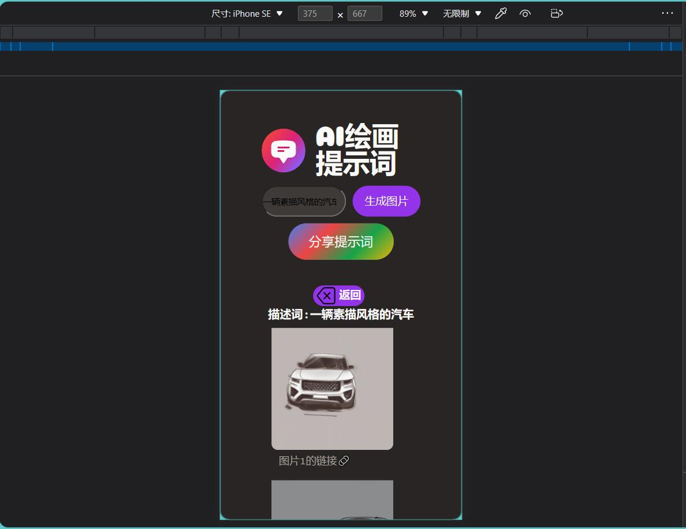
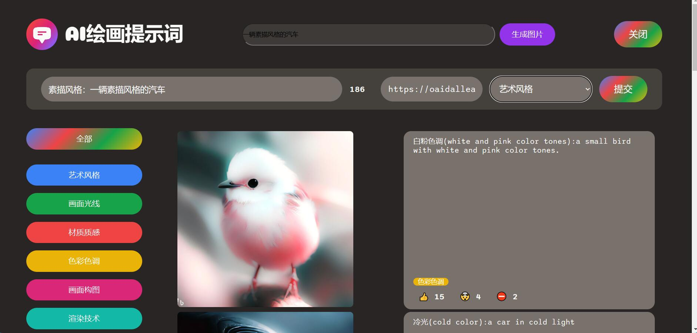
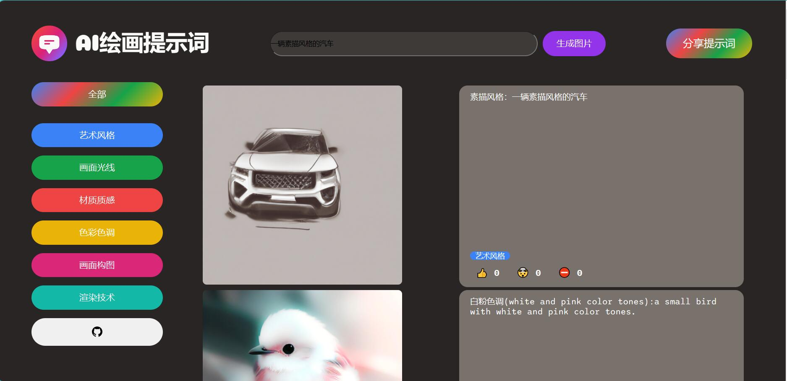

# Getting Started with Create React App

This project was bootstrapped with [Create React App](https://github.com/facebook/create-react-app).
这个项目是使用 Create React App 工具进行快速启动的。

## Available Scripts 可用脚本

In the project directory, you can run:
在项目目录下，你可以运行以下命令：

### `npm start`

Runs the app in the development mode.\
Open [http://localhost:3000](http://localhost:3000) to view it in your browser.

The page will reload when you make changes.\
You may also see any lint errors in the console.
在开发模式下运行应用程序。
在浏览器中打开 http://localhost:3000 来查看它。

当你进行更改时，页面将重新加载。
您还可以在控制台中看到任何 lint 错误。

### `npm test`

Launches the test runner in the interactive watch mode.\
See the section about [running tests](https://facebook.github.io/create-react-app/docs/running-tests) for more information.

### `npm run build`

Builds the app for production to the `build` folder.\
It correctly bundles React in production mode and optimizes the build for the best performance.

The build is minified and the filenames include the hashes.\
Your app is ready to be deployed!

See the section about [deployment](https://facebook.github.io/create-react-app/docs/deployment) for more information.
将应用程序构建为生产版本并生成到 build 文件夹。
它将以生产模式正确地捆绑 React 并优化构建以获得最佳性能。

构建是经过缩小的，并且文件名包括哈希值。
您的应用程序已准备好部署！

有关更多信息，请参见有关 部署 的部分。

### Demonstrate Functionality 演示功能

### Deployment 部署

This project is a React project about AI painting that uses Supabase as the database and calls the OpenAI API. It is deployed on the Netlify cloud platform. The project link is https://aipainting-ck.netlify.app/.
本项目是一个关于 ai 绘画的 react 项目，用 supabase 作为数据库，调用了 openai 的 API，在 netlify 云平台部署，项目链接是https://aipainting-ck.netlify.app/
